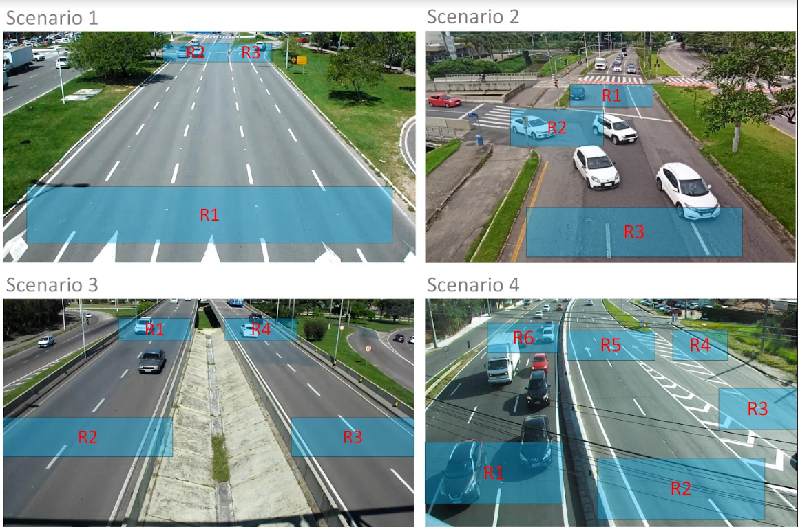
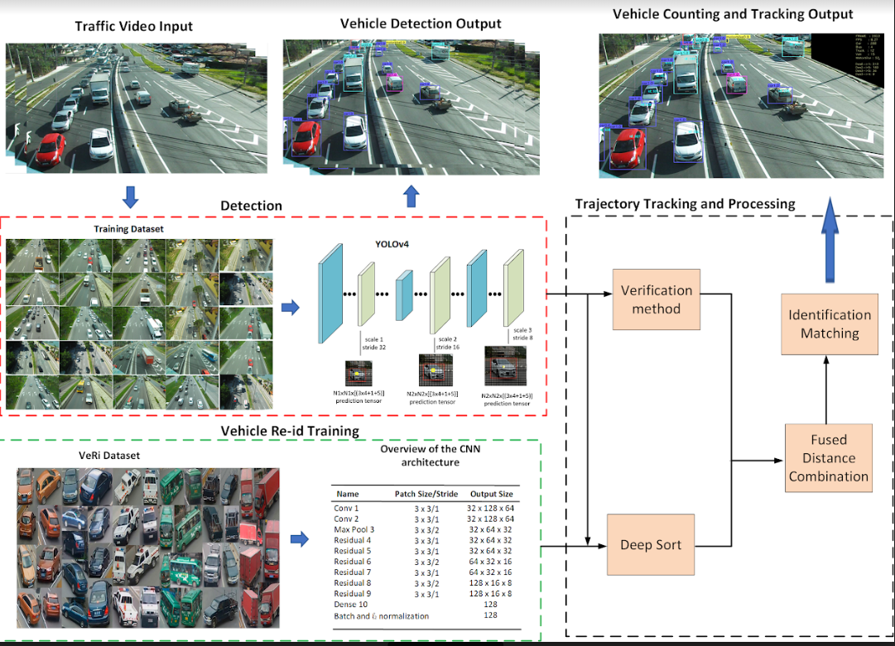

# Vehicle Counting
Codigo que permite realizar el conteo y clasificacion de vehiculos con Yolov4. 


## Descripcion
Este repositorio utiliza conteo por linea virtual y conteo por regiones. El cual, perimite identificar cuantos y que tipo de vehiculos de desplazan de una region x a una region y.


<p align="center">
  
</p>




El modelo fue entrenado usando [Google colab](https://colab.research.google.com/). Fue usando un tamano del lote de 64 con una taza de aprendizaje de 0.003.

## Metrics
Fueron utilizadas las metricas de pascal para evaluar el modelo de deteccion.

| Modelo        | mAP (%)          | IoU (%) |
| ------------- |:-------------:| -----:|
| YOLOv2      | 60 | 54 |
| YOLOv3      | 64      |   58 |
| YOLOv4      | 69      |    63 |


##Requirements
### python requirements 
Instals estos requerimientos 

```bash
# instalar
pip install -r requirements.txt
```
